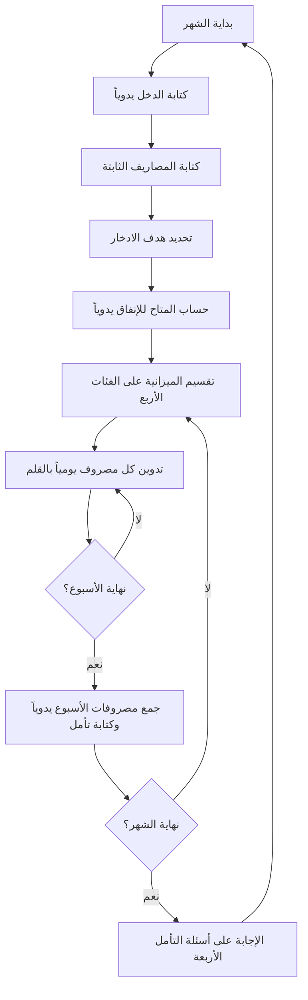
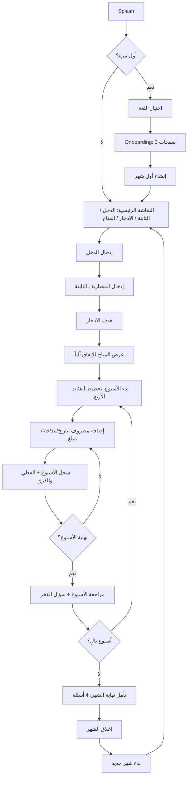
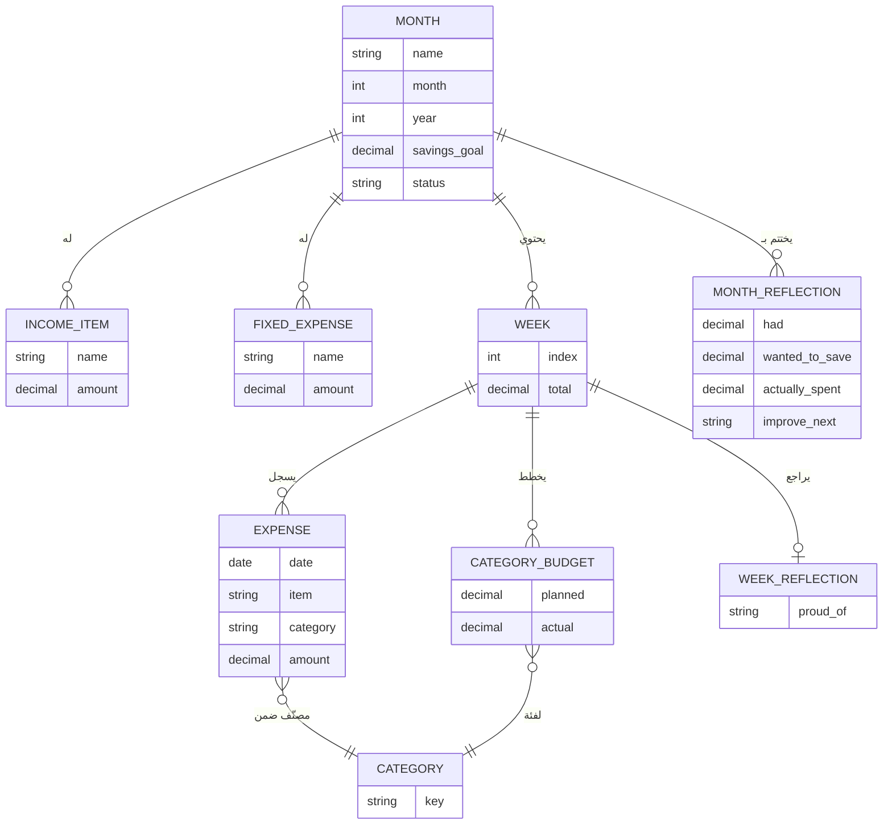

<!--
ملاحظة: هذا المستند وثيقة متطلبات عمل (BRD) لتطبيق Kakeibo Journal.
المشروع مستقل عن نظام Maintenance Production ومحفوظ هنا كوثيقة تسليم فقط.
-->

# وثيقة متطلبات العمل (BRD) — تطبيق Kakeibo Journal

> **Business Requirements Document — Kakeibo Journal Mobile App**
>
> دفتر كاكيبو الياباني للتخطيط المالي، بصيغة رقمية بسيطة على منصة Android.

---

## 1. ضبط المستند (Document Control)

| البند | التفاصيل |
|---|---|
| اسم المشروع | Kakeibo Journal |
| نوع الوثيقة | Business Requirements Document (BRD) |
| الإصدار | 1.0 |
| الحالة | مسودة للاعتماد (Draft for Approval) |
| التاريخ | 2026-07-24 |
| المُعِدّ | فريق تحليل الأعمال |
| المصدر | ملاحظات العميل + ملف `Kakeibo_Journal_EN_AR.pdf` |
| الجمهور المستهدف للاعتماد | مالك المنتج / صاحب الفكرة `[افتراض]` |

### سجل التغييرات (Revision History)

| الإصدار | التاريخ | الوصف | المُعِدّ |
|---|---|---|---|
| 0.1 | 2026-07-24 | الملاحظات الأولية الخام | العميل |
| 1.0 | 2026-07-24 | إعادة هيكلة وصياغة رسمية للمتطلبات | تحليل الأعمال |

### المصطلحات (Glossary)

| المصطلح | المعنى |
|---|---|
| Kakeibo (كاكيبو) | منهج ياباني لتدوين المصروفات يدوياً بهدف الوعي المالي قبل الإنفاق |
| الشهر (Month Cycle) | دورة تخطيط مالي كاملة تبدأ بإدخال الدخل وتنتهي بالتأمل الشهري |
| الفئات الأربع | التصنيفات الثابتة للمصروفات: Needs / Wants / Culture / Unexpected |
| المتاح للإنفاق (Available to Spend) | الدخل − المصاريف الثابتة − هدف الادخار |
| التأمل (Reflection) | أسئلة نهاية الأسبوع/الشهر التي تعزز الوعي المالي |
| Wizard | تدفق خطوة بخطوة يقود المستخدم بترتيب ثابت |

---

## 2. الملخص التنفيذي (Executive Summary)

Kakeibo Journal تطبيق Android يحوّل دفتر كاكيبو الورقي إلى تجربة رقمية بسيطة مع الحفاظ على نفس الفلسفة وأسلوب الاستخدام. لا يهدف التطبيق إلى أن يكون نظاماً محاسبياً أو أداة لإدارة الحسابات البنكية أو منصة رسوم بيانية معقدة، بل إلى غرس عادة **"أن يفكر المستخدم قبل أن يصرف"**.

يقود التطبيق المستخدم عبر رحلة خطية (Step-by-Step Wizard): إنشاء الشهر ← تسجيل الدخل والمصاريف الثابتة ← تحديد هدف الادخار ← معرفة المتاح للإنفاق ← تخطيط أسبوعي عبر الفئات الأربع ← تسجيل يومي ← مراجعة نهاية الأسبوع ← تأمل نهاية الشهر ← بدء شهر جديد. الهوية البصرية هادئة وفاخرة (Cream / Beige / Dark Blue / Gold) بحيث يشعر المستخدم أنه يمسك دفتراً ورقياً أنيقاً لا برنامج محاسبة.

---

## 3. الخلفية وبيان المشكلة (Background & Problem Statement)

منهج كاكيبو الورقي فعّال في بناء الوعي المالي، لكنه يعاني من احتكاكات عملية:

- **بطء التدوين اليدوي** يجعل المستخدم يهمل تسجيل المصروفات لحظة حدوثها.
- **صعوبة حساب المتاح للإنفاق** والفروقات بين المخطط والفعلي يدوياً.
- **ضياع الدفتر أو تلفه** يفقد المستخدم تاريخه المالي.
- **تطبيقات المحاسبة الرقمية البديلة معقّدة** ومزدحمة بالأرقام والجداول، فتُفقِد المنهج بساطته وروحه.

**المشكلة:** لا يوجد حل رقمي بسيط يحافظ على فلسفة كاكيبو وطقوسها الخطوية دون تحويلها إلى أداة محاسبية معقدة.

---

## 4. الأهداف ومؤشرات النجاح (Objectives & Success Metrics)

| # | الهدف (Business Objective) | مؤشر النجاح (Success Metric) |
|---|---|---|
| OBJ-1 | تقليل الوقت اللازم لتسجيل المصروف | إتمام تسجيل مصروف واحد في **≤ 3 ضغطات** ووقت **≤ 20 ثانية** `[افتراض للقيمة الزمنية]` |
| OBJ-2 | تشجيع التخطيط قبل بداية كل شهر | نسبة المستخدمين الذين يكملون إعداد الشهر (دخل + مصاريف ثابتة + هدف ادخار) ≥ **80%** `[افتراض]` |
| OBJ-3 | تسهيل المراجعة الأسبوعية | نسبة الأسابيع التي تُختَم بمراجعة (Reflection) ≥ **60%** `[افتراض]` |
| OBJ-4 | تشجيع الادخار | نسبة الأشهر التي يُحدَّد لها هدف ادخار > 0 ≥ **90%** `[افتراض]` |
| OBJ-5 | جعل تجربة الدفتر ممتعة وبسيطة | لا تحتوي أي شاشة على أكثر من مهمة/إجراء رئيسي واحد (قابل للتدقيق في التصميم) |
| OBJ-6 | إكمال دورة كاكيبو الكاملة | نسبة المستخدمين الذين يغلقون الشهر ويبدؤون شهراً جديداً ≥ **50%** `[افتراض]` |

> الأرقام المستهدفة المُعلَّمة بـ `[افتراض]` تحتاج اعتماد مالك المنتج قبل تثبيتها.

---

## 5. النطاق (Scope)

### 5.1 داخل النطاق (In Scope) — الإصدار الأول

- Splash Screen + Onboarding (3 صفحات) + اختيار اللغة.
- إنشاء شهر (الاسم، الشهر، السنة، هدف الادخار).
- إدارة الدخل والمصاريف الثابتة (قوائم بسيطة: اسم + مبلغ).
- حساب "المتاح للإنفاق" آلياً.
- تخطيط أسبوعي عبر الفئات الأربع (المخطط / الفعلي / الفرق).
- تسجيل المصروفات اليومية وسجل الأسبوع.
- مراجعة نهاية الأسبوع (سؤال تأمل واحد).
- تأمل نهاية الشهر (الأسئلة الأربعة) وإغلاق الشهر.
- صفحة الأشهر السابقة (قراءة فقط).
- Bottom Navigation: Home / Weeks / History / Settings.
- دعم لغتين (عربي/إنجليزي) مع RTL.

### 5.2 خارج النطاق (Out of Scope) — الإصدار الأول

- الربط بالحسابات أو البطاقات البنكية أو استيراد كشوف الحساب.
- الرسوم البيانية والتقارير التحليلية المعقدة.
- تعدد العملات وأسعار الصرف (عملة واحدة فقط في الإصدار الأول `[افتراض: AED]`).
- المزامنة السحابية ومشاركة الدفتر بين عدة مستخدمين/أجهزة.
- التذكيرات/الإشعارات المجدولة (Reminders) — مرشّحة لمرحلة لاحقة.
- نسخة iOS أو الويب (Android فقط في الإصدار الأول).
- تعديل الشهر بعد إغلاقه (يصبح للقراءة فقط).
- تصنيفات مصروفات قابلة للتخصيص خارج الفئات الأربع.

---

## 6. أصحاب المصلحة وأدوار المستخدمين (Stakeholders & User Roles)

| الطرف | الدور | الاهتمام | التأثير |
|---|---|---|---|
| مالك المنتج | يعتمد المتطلبات ويحدد الأولويات | عالٍ | عالٍ |
| المستخدم النهائي (فرد) | يخطط ويسجل ويراجع مصروفاته | عالٍ | متوسط |
| فريق التطوير | يبني التطبيق | متوسط | عالٍ |
| مصمم UX/UI | يحقق الهوية البصرية والبساطة | متوسط | متوسط |

**الفئات المستهدفة:** الموظفون، الطلاب، الأسر، وكل من يريد تنظيم مصروفاته دون تعقيد محاسبي.

**أدوار المستخدم:** الإصدار الأول يعتمد مستخدماً واحداً محلياً على الجهاز، دون حسابات أو صلاحيات متعددة `[افتراض]`.

---

## 7. العملية الحالية (As-Is) — الدفتر الورقي

**نقاط الألم:** الحساب اليدوي بطيء ومعرّض للخطأ، والتدوين المتأخر، وخطر فقدان الدفتر.

---

## 8. العملية المقترحة (To-Be) — التطبيق الرقمي

---

## 9. المتطلبات الوظيفية (Functional Requirements)

الأولوية وفق MoSCoW: **M** = Must، **S** = Should، **C** = Could، **W** = Won't (هذا الإصدار).
المصدر: BRD الخام المقدَّم من العميل ما لم يُذكر خلاف ذلك.

### 9.1 التهيئة والدخول (Onboarding)

| ID | المتطلب | الأولوية | معيار القبول |
|---|---|---|---|
| FR-001 | يجب أن يعرض التطبيق Splash Screen يحتوي شعار التطبيق واسمه عند بدء التشغيل. | M | تظهر شاشة البداية ثم تنتقل تلقائياً خلال ≤ 3 ثوانٍ `[افتراض]`. |
| FR-002 | يجب أن يتيح التطبيق للمستخدم اختيار اللغة (عربي/إنجليزي) عند أول تشغيل. | M | يُطبَّق الاختيار فوراً على كامل الواجهة بما فيها اتجاه RTL/LTR. |
| FR-003 | يجب أن يعرض التطبيق Onboarding من 3 صفحات فقط: ما هو كاكيبو؟ / كيف يعمل؟ / ابدأ أول شهر. | M | تظهر 3 صفحات بالضبط مع إمكانية التخطي، ولا تتكرر بعد أول إكمال. |
| FR-004 | يجب أن ينقل زر "ابدأ" في نهاية Onboarding المستخدم مباشرةً إلى شاشة إنشاء الشهر. | M | الضغط ينقل إلى إنشاء الشهر دون خطوات وسيطة. |

### 9.2 إنشاء الشهر وإدارته

| ID | المتطلب | الأولوية | معيار القبول |
|---|---|---|---|
| FR-005 | يجب أن يتيح التطبيق إنشاء شهر بإدخال: الاسم، الشهر، السنة، هدف الادخار. | M | لا يمكن إنشاء الشهر قبل تعبئة الحقول الأربعة (راجع BR-002). |
| FR-006 | يجب أن يعرض التطبيق الشاشة الرئيسية بأربع بطاقات فقط: الدخل، المصاريف الثابتة، هدف الادخار، المتاح للإنفاق. | M | تظهر 4 بطاقات فقط وزر رئيسي واحد "ابدأ الأسبوع الأول". |
| FR-007 | يجب أن يمنع التطبيق إنشاء شهرين بنفس (الشهر + السنة). | S | محاولة تكرار نفس الشهر/السنة تُرفض برسالة واضحة (BR-006). |
| FR-008 | يجب أن يعرض التطبيق قائمة الأشهر السابقة، وعند فتح أي شهر يُعرض كاملاً للقراءة فقط. | M | الشهر المُغلق لا يقبل أي تعديل على بياناته. |

### 9.3 الدخل والمصاريف الثابتة

| ID | المتطلب | الأولوية | معيار القبول |
|---|---|---|---|
| FR-009 | يجب أن يتيح التطبيق إضافة عناصر دخل، كل عنصر باسم ومبلغ. | M | يظهر العنصر في القائمة فور الحفظ ويُحدَّث إجمالي الدخل. |
| FR-010 | يجب أن يتيح التطبيق إضافة عناصر مصاريف ثابتة، كل عنصر باسم ومبلغ. | M | يظهر العنصر فور الحفظ ويُحدَّث إجمالي المصاريف الثابتة. |
| FR-011 | يجب أن يتيح التطبيق تعديل وحذف عناصر الدخل والمصاريف الثابتة ما دام الشهر مفتوحاً. | S | الحذف/التعديل يُحدِّث الإجماليات والمتاح للإنفاق فوراً. |

### 9.4 الحساب الآلي

| ID | المتطلب | الأولوية | معيار القبول |
|---|---|---|---|
| FR-012 | يجب أن يحسب التطبيق "المتاح للإنفاق" آلياً = الدخل − المصاريف الثابتة − هدف الادخار (BR-001). | M | يتغير الرقم فوراً عند أي تعديل في المدخلات، ويطابق الحساب اليدوي. |
| FR-013 | يجب أن يحسب التطبيق لكل فئة أسبوعية: الفعلي (مجموع مصروفاتها) والفرق (المخطط − الفعلي). | M | مجموع الفعلي = مجموع مصروفات الفئة، والفرق يتحدث مع كل مصروف. |

### 9.5 الأسبوع والمصروفات

| ID | المتطلب | الأولوية | معيار القبول |
|---|---|---|---|
| FR-014 | يجب أن يتيح التطبيق تحديد ميزانية مخططة للفئات الأربع (Needs/Wants/Culture/Unexpected) لكل أسبوع. | M | تُحفظ القيم المخططة وتظهر في جدول الأسبوع. |
| FR-015 | يجب أن يتيح التطبيق إضافة مصروف بحقول: التاريخ، البند، الفئة، المبلغ — فقط لا غير. | M | لا تظهر أي حقول إضافية؛ الحفظ يتطلب الحقول الأربعة (BR-003). |
| FR-016 | يجب أن تكون الفئة في شاشة إضافة المصروف محصورة في الفئات الأربع المعرّفة. | M | لا يمكن اختيار فئة خارج القائمة الثابتة. |
| FR-017 | يجب أن يعرض التطبيق سجل الأسبوع بكل عملية على هيئة Card (التاريخ، البند، الفئة، المبلغ). | M | تظهر كل عملية مسجلة كبطاقة مطابقة للبيانات المحفوظة. |
| FR-018 | يجب أن يعرض التطبيق نهاية الأسبوع: إجمالي الأسبوع + سؤال "ما الشيء الذي تفتخر به؟" + زر "الأسبوع التالي". | M | يظهر الإجمالي الصحيح ويُحفظ نص الإجابة قبل الانتقال. |
| FR-019 | يجب أن ينشئ التطبيق الأسبوع التالي مع تصفير الفعلي والاحتفاظ بإمكانية تخطيط ميزانية جديدة. | S | الأسبوع الجديد يبدأ فارغاً من المصروفات مع خانات تخطيط جديدة. |

### 9.6 نهاية الشهر والدورة

| ID | المتطلب | الأولوية | معيار القبول |
|---|---|---|---|
| FR-020 | يجب أن يعرض التطبيق في نهاية الشهر الأسئلة الأربعة: كم كان لديّ؟ / كم أردت أن أدخر؟ / كم أنفقت فعلاً؟ / ما الذي سأحسّنه؟ | M | تظهر الأسئلة الأربعة وتُحفظ الإجابات ضمن أرشيف الشهر. |
| FR-021 | يجب أن يتيح التطبيق إغلاق الشهر بعد التأمل، ثم بدء شهر جديد. | M | بعد الإغلاق يتحول الشهر لقراءة فقط ويمكن إنشاء شهر تالٍ. |

### 9.7 التنقل والتجربة

| ID | المتطلب | الأولوية | معيار القبول |
|---|---|---|---|
| FR-022 | يجب أن يوفر التطبيق Bottom Navigation من 4 عناصر: Home / Weeks / History / Settings. | M | كل عنصر ينقل للقسم الصحيح مع إبراز التبويب النشط. |
| FR-023 | يجب ألا تحتوي أي شاشة على أكثر من إجراء رئيسي واحد (Primary Action). | M | مراجعة كل شاشة تؤكد وجود زر رئيسي واحد بارز (BR-005). |
| FR-024 | يجب ألا تظهر شاشة فارغة؛ في حال غياب البيانات تُعرض رسالة إرشادية (مثل "ابدأ بإضافة أول مصروف"). | M | كل قائمة فارغة تعرض حالة فارغة (Empty State) إرشادية. |
| FR-025 | يجب أن تعرض كل عملية حفظ Animation صغيرة للتأكيد. | S | يظهر تأثير بصري قصير عند نجاح الحفظ. |
| FR-026 | يجب أن يحفظ التطبيق كل البيانات محلياً على الجهاز وتبقى بعد إغلاق التطبيق. | M | إعادة فتح التطبيق تُظهر آخر حالة محفوظة كاملة. |

---

## 10. المتطلبات غير الوظيفية (Non-Functional Requirements)

| ID | الفئة | المتطلب | معيار القبول |
|---|---|---|---|
| NFR-001 | قابلية الاستخدام | أي عملية أساسية لا تتطلب أكثر من **3 ضغطات**. | تسجيل مصروف من الشاشة الرئيسية ≤ 3 ضغطات. |
| NFR-002 | قابلية الاستخدام | مهمة واحدة فقط ظاهرة لكل شاشة، دون ازدحام أو جداول معقدة. | تدقيق التصميم يؤكد القاعدة على كل الشاشات. |
| NFR-003 | الأداء | استجابة واجهة سلسة وحفظ فوري محلي. | زمن استجابة أي إجراء ≤ 300ms على جهاز متوسط `[افتراض]`. |
| NFR-004 | التوطين | دعم العربية (RTL) والإنجليزية (LTR) دون كسر التخطيط. | تبديل اللغة يعكس الاتجاه ويحافظ على المحاذاة. |
| NFR-005 | الهوية البصرية | ألوان هادئة: Cream / Beige / Dark Blue / Gold، أيقونات Outline، خط Cairo أو IBM Plex Arabic. | مطابقة التصميم للوحة الألوان والخطوط المحددة. |
| NFR-006 | المنصة | يعمل على Android إصدار `[افتراض: 8.0 فأحدث]`. | تثبيت وتشغيل ناجح على الإصدارات المستهدفة. |
| NFR-007 | الخصوصية | تُخزَّن البيانات محلياً فقط دون إرسالها لأي خادم في الإصدار الأول. | لا يصدر أي طلب شبكة يحمل بيانات المستخدم. |
| NFR-008 | الموثوقية | لا تُفقد البيانات عند إغلاق التطبيق أو انقطاعه. | إغلاق مفاجئ ثم فتح يستعيد آخر حالة محفوظة. |
| NFR-009 | تقليل النوافذ المنبثقة | عدم استخدام Popup إلا للضرورة القصوى. | مراجعة التصميم تؤكد اقتصار الـ Popup على التأكيدات الحرجة. |

---

## 11. قواعد العمل (Business Rules)

| ID | القاعدة |
|---|---|
| BR-001 | المتاح للإنفاق = إجمالي الدخل − إجمالي المصاريف الثابتة − هدف الادخار. |
| BR-002 | لا يُنشأ الشهر إلا بعد تعبئة: الاسم، الشهر، السنة، هدف الادخار. |
| BR-003 | لا يُحفظ المصروف إلا بعد تعبئة: التاريخ، البند، الفئة، المبلغ. |
| BR-004 | فئات المصروفات محصورة حصراً في أربع: Needs / Wants / Culture / Unexpected. |
| BR-005 | كل شاشة لها إجراء رئيسي واحد فقط (Primary Action). |
| BR-006 | لا يُسمح بوجود شهرين بنفس تركيبة (الشهر + السنة). |
| BR-007 | بعد إغلاق الشهر تصبح بياناته للقراءة فقط ولا تقبل التعديل. |
| BR-008 | جميع المبالغ أرقام موجبة أكبر من صفر `[افتراض]`. |
| BR-009 | العملة موحّدة على مستوى التطبيق (عملة واحدة، `[افتراض: AED]`). |

---

## 12. متطلبات البيانات والتكامل (Data Requirements & Integrations)

**التكامل الخارجي:** لا يوجد في الإصدار الأول (تطبيق محلي بالكامل، بلا API خارجي).

### الكيانات الأساسية (Conceptual Data Model)

| الكيان | الحقول الرئيسية | ملاحظات |
|---|---|---|
| Month | name, month, year, savings_goal, status (open/closed) | الوحدة الأساسية للدورة |
| Income Item | name, amount | ينتمي لشهر |
| Fixed Expense | name, amount | ينتمي لشهر |
| Week | index, planned/actual لكل فئة | ينتمي لشهر |
| Category | key ∈ {Needs, Wants, Culture, Unexpected} | قائمة ثابتة |
| Expense | date, item, category, amount | ينتمي لأسبوع |
| Week Reflection | proud_of | سؤال نهاية الأسبوع |
| Month Reflection | had, wanted_to_save, actually_spent, improve_next | أسئلة نهاية الشهر الأربعة |

**التخزين:** قاعدة بيانات محلية على الجهاز `[افتراض: SQLite / Room]`.

---

## 13. الافتراضات والاعتماديات والقيود (Assumptions / Dependencies / Constraints)

### الافتراضات (Assumptions) — قابلة للعدّ

1. `[افتراض]` العملة الافتراضية AED وموحّدة عبر التطبيق.
2. `[افتراض]` مستخدم واحد محلي على الجهاز، بلا تسجيل حساب أو صلاحيات.
3. `[افتراض]` Android 8.0 فأحدث هو الحد الأدنى المدعوم.
4. `[افتراض]` القيم الرقمية للأهداف في القسم 4 مبدئية وتحتاج اعتماد مالك المنتج.
5. `[افتراض]` التخزين محلي (SQLite/Room) دون مزامنة سحابية.
6. `[افتراض]` المبالغ أرقام موجبة، وتنسيق التاريخ يتبع إعدادات الجهاز.

### الاعتماديات (Dependencies)

- توفّر خطي Cairo أو IBM Plex Arabic ولوحة أيقونات Outline.
- اعتماد الهوية البصرية والنصوص التعريفية (Onboarding) من مالك المنتج.

### القيود (Constraints)

- منصة Android فقط في الإصدار الأول.
- الالتزام بفلسفة البساطة: لا رسوم بيانية معقدة ولا وظائف محاسبية.
- حد أقصى 3 ضغطات لأي عملية أساسية.

---

## 14. سجل المخاطر والافتراضات والمشكلات والاعتماديات (RAID Log)

| النوع | البند | الأثر | الاستجابة المقترحة |
|---|---|---|---|
| Risk | زحف النطاق نحو ميزات محاسبية تُفقِد البساطة | عالٍ | تثبيت قسم "خارج النطاق" ومراجعة كل طلب جديد مقابله |
| Risk | فقدان البيانات المحلية عند تغيير/تلف الجهاز (لا سحابة) | متوسط | تقديم تصدير/نسخ احتياطي يدوي في مرحلة لاحقة |
| Risk | عدم وضوح النصوص التعريفية لكاكيبو يُربك مستخدماً جديداً | متوسط | مراجعة محتوى Onboarding مع مالك المنتج مبكراً |
| Assumption | الأرقام المستهدفة في مؤشرات النجاح مبدئية | متوسط | اعتمادها رسمياً قبل قياس الأداء |
| Issue | العملة والمنطقة الزمنية/التاريخ غير محددة نهائياً | منخفض | تثبيتها في قرار تصميم مبكر |
| Dependency | توفر الخطوط والأيقونات والهوية البصرية | متوسط | تأمينها قبل بدء بناء الواجهات |

---

## 15. معايير القبول ونهج اختبار المستخدم (Acceptance Criteria & UAT)

**نهج UAT:** اختبار الرحلة الكاملة (End-to-End) لدورة شهر واحد، مع سيناريوهات المسار السعيد والمسارات السلبية.

### سيناريوهات القبول الأساسية

1. **إنشاء شهر:** إدخال الاسم/الشهر/السنة/الادخار ← إنشاء ناجح وظهور الشاشة الرئيسية بأربع بطاقات.
2. **حساب المتاح:** إدخال دخل ومصاريف ثابتة وهدف ادخار ← عرض المتاح = الدخل − الثابتة − الادخار (BR-001).
3. **تسجيل مصروف في 3 ضغطات:** من الرئيسية حتى الحفظ ≤ 3 ضغطات (NFR-001).
4. **الفروقات الأسبوعية:** إضافة مصروفات ← تحديث الفعلي والفرق لكل فئة (FR-013).
5. **نهاية الأسبوع:** عرض الإجمالي + حفظ سؤال الفخر + الانتقال للأسبوع التالي.
6. **نهاية الشهر:** الإجابة على الأسئلة الأربعة ← إغلاق الشهر ← الشهر يصبح للقراءة فقط (BR-007).
7. **الأرشيف:** فتح شهر سابق ← يُعرض كاملاً دون إمكانية التعديل (FR-008).

### سيناريوهات المسار السلبي (Negative Path)

- محاولة حفظ مصروف بحقل ناقص ← يُرفض الحفظ برسالة واضحة (BR-003).
- محاولة إدخال مبلغ ≤ 0 أو غير رقمي ← يُرفض (BR-008).
- محاولة إنشاء شهر مكرر (نفس الشهر/السنة) ← يُرفض (BR-006).
- محاولة تعديل شهر مغلق ← غير مسموح (BR-007).
- قائمة فارغة ← تظهر حالة إرشادية لا شاشة فارغة (FR-024).

### تعريف الجاهزية (Definition of Done)

- [ ] كل المتطلبات ذات الأولوية Must مُنفَّذة ومختبَرة.
- [ ] الرحلة الكاملة لدورة شهر تعمل من البداية للنهاية.
- [ ] دعم RTL/LTR مؤكد على العربية والإنجليزية.
- [ ] لا شاشة تتجاوز إجراءً رئيسياً واحداً ولا شاشة فارغة بلا إرشاد.

---

## 16. الأسئلة المفتوحة والخطوات التالية (Open Questions & Next Actions)

### أسئلة مفتوحة (تحتاج قرار مالك المنتج)

| # | السؤال |
|---|---|
| Q1 | ما العملة المعتمدة؟ وهل يُسمح بتغييرها؟ |
| Q2 | هل تُثبَّت الأرقام المستهدفة لمؤشرات النجاح كما في القسم 4؟ |
| Q3 | هل نحتاج تصدير/نسخ احتياطي للبيانات في الإصدار الأول أم لاحقاً؟ |
| Q4 | كم أسبوعاً في الشهر (4 ثابتة أم مرن حسب التقويم)؟ |
| Q5 | ما الحد الأدنى لإصدار Android المدعوم؟ |
| Q6 | هل التذكيرات/الإشعارات ضمن الإصدار الأول أم مؤجلة؟ |

### الخطوات التالية (Next Actions)

1. اعتماد النطاق ومؤشرات النجاح من مالك المنتج.
2. الإجابة على الأسئلة المفتوحة أعلاه.
3. تحويل المتطلبات إلى Epics + User Stories للفريق التقني (اختياري كوثيقة تالية).
4. إعداد نماذج Wireframes منخفضة الدقة للشاشات الرئيسية وفق الهوية البصرية.

---

## 17. مصفوفة التتبع (Traceability Matrix)

| الهدف | المتطلبات المرتبطة | سيناريو الاختبار |
|---|---|---|
| OBJ-1 (سرعة التسجيل) | FR-015, NFR-001, NFR-002 | سيناريو 3 |
| OBJ-2 (التخطيط الشهري) | FR-005, FR-006, FR-009, FR-010, FR-012 | سيناريوهات 1، 2 |
| OBJ-3 (المراجعة الأسبوعية) | FR-013, FR-017, FR-018 | سيناريوهات 4، 5 |
| OBJ-4 (تشجيع الادخار) | FR-005, FR-012 (هدف الادخار ضمن المعادلة) | سيناريو 2 |
| OBJ-5 (بساطة التجربة) | FR-006, FR-023, FR-024, NFR-002, NFR-009 | تدقيق تصميم + سيناريو 3 |
| OBJ-6 (إكمال الدورة) | FR-020, FR-021, FR-008 | سيناريوهات 6، 7 |

---

_نهاية المستند — الإصدار 1.0_
